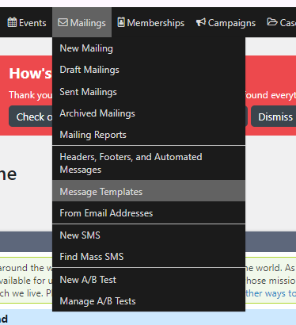
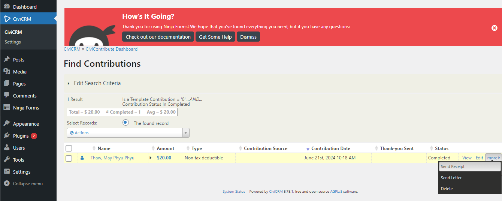
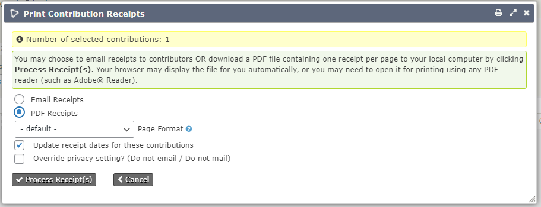
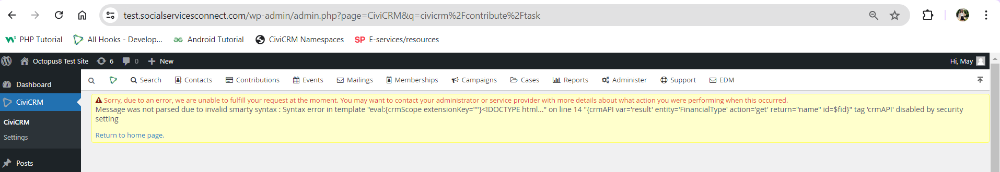

# enable_crmapi

## Objective
To enable the tag "crmAPI" in the higher versions of CiviCRM (starting from 5.75.0) because Smarty ver4 has more intense security restrictions.

## How it works
If you are using Smarty Version 4 and you want to send or generate contribution emails or receipts using ‘crmAPI’ tag within the “Message Templates”, you will get the ‘crmAPI’ tag error message shown in Figure 4 once you try to generate the receipt.

Hence, this extension will enable the tag ‘crmAPI’ so that you can generate the receipts successfully.

Please keep in mind that your Message Templates need to be compatible with Smarty Version4 syntax. If not, modify the template to align with Smarty ver4 syntax.

This is an [extension for CiviCRM](https://docs.civicrm.org/sysadmin/en/latest/customize/extensions/), licensed under [AGPL-3.0](LICENSE.txt).